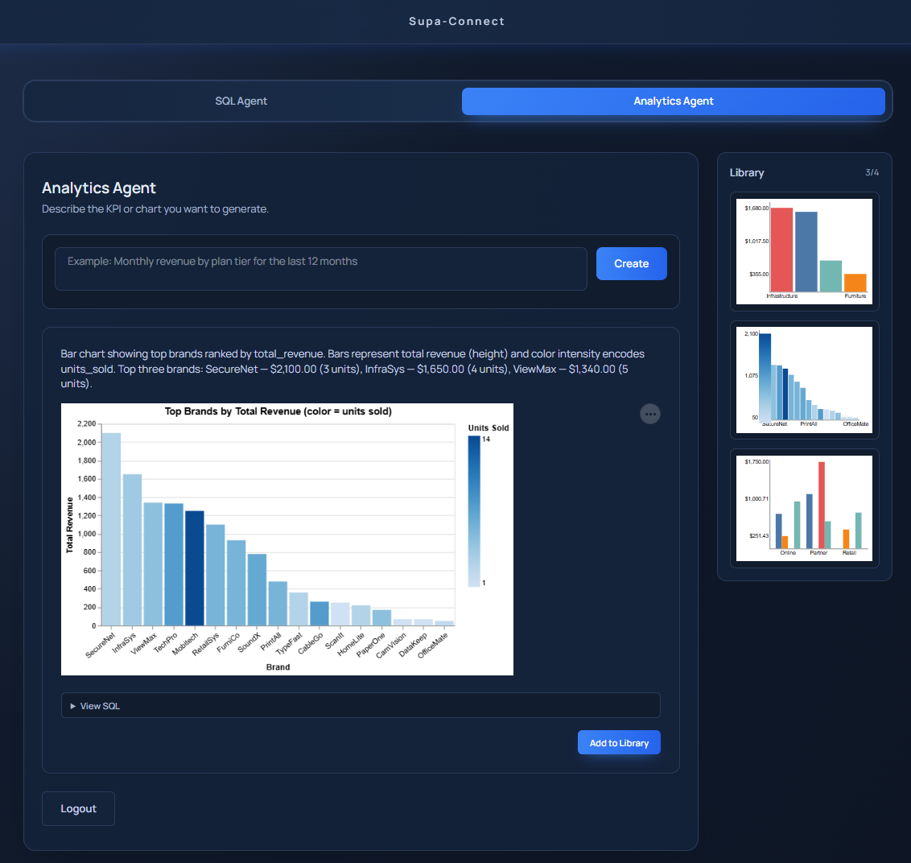
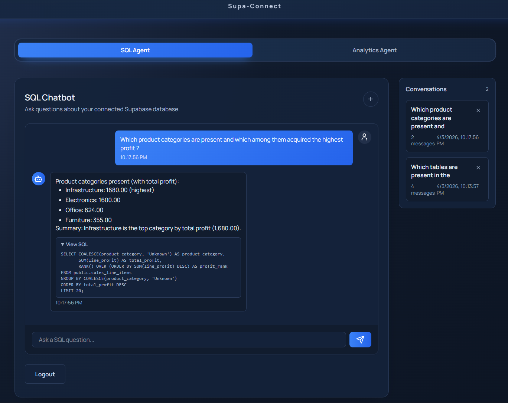

# Supa-Connect : AI Powered SQL and Visual Analytics

A production-oriented natural-language analytics platform that lets users connect their own Supabase database, ask questions in plain English, generate SQL automatically, derive AI-assisted insights, and render professional charts from the underlying query results.

The platform is designed for both technical and non-technical users. It prioritizes transparency by always surfacing the exact SQL used to produce answers and visualizations.

Access LIVE App here - https://d3bgm1sor0pojd.cloudfront.net/

## Core Capabilities

- Natural-language-to-SQL chat for exploratory analysis
- Natural-language-to-visualization workflows for chart generation
- Automated KPI and chart suggestions after database connection
- SQL conversation library for saved analytical context
- Personal chart library for reusable visual outputs
- Transparent SQL output for every generated insight or chart
- User-scoped data isolation for memory, charts, metadata, and tokens

## Application Functional Workflow

The diagram below shows the high-level functional workflow of the application, from user authentication and Supabase connection through metadata extraction, SQL generation, chart creation, and user-scoped persistence.


## OAuth and MCP

This project separates authorization from database interaction:

- OAuth handles permission and token grant.
- MCP handles the actual structured communication with the connected Supabase database.

In practice:

- Clerk authenticates the user into the app.
- Supabase OAuth authorizes access to the user's Supabase project.
- MCP is then used as the operational channel for metadata extraction and SQL execution.

## Runtime Architecture

### Frontend

- Next.js static export hosted in S3
- Delivered globally through CloudFront
- Clerk-based application authentication
- React Vega rendering for chart specifications returned by the backend

### Backend

- FastAPI application packaged as a Lambda container image
- Main API Lambda handles user-facing SQL and chart requests
- Separate worker Lambdas process metadata extraction and chart generation jobs from SQS
- API Gateway exposes HTTP endpoints consumed by the frontend

### Data and Persistence

- App database stores extracted metadata state, user MCP tokens, and job status
- User-scoped S3 memory bucket stores conversation memory, chart suggestions, and chart library data
- Redis caches metadata and MCP tokens to reduce repeated extraction and connection overhead

## Agent Responsibilities

### SQL Agent

- Uses extracted schema metadata as database context
- Converts user questions into SQL
- Executes SQL through MCP
- Returns natural-language answers plus exact generated SQL
- Persists conversation history in the conversation library

### Analytics Agent

- Uses extracted schema metadata as database context
- Executes SQL through MCP
- Builds chart-oriented responses and chart specifications from query results
- Returns professional visual outputs rendered on the frontend with React Vega
- Persists charts into a personal chart library

### Background Workers

- Metadata worker extracts and refreshes connected database metadata asynchronously
- Chart worker handles asynchronous chart-generation jobs
- Worker results update shared job state that the UI polls to determine readiness

## Application Screenshots

The screenshots below show representative user flows across the SQL and analytics experience, including conversational querying, generated SQL transparency, and visualization-oriented workflows.

### SQL and Analytics Experience





## Repository Structure

```text
.
|-- backend/               # FastAPI app, agents, MCP service, worker handlers
|-- frontend/              # Next.js static frontend, UI components, chart rendering
|-- scripts/               # Deployment and destroy automation
|-- terraform/             # Main AWS infrastructure stack
|-- terraform-backend/     # Terraform state bucket and lock table bootstrap
|-- terraform-oidc/        # GitHub Actions OIDC role bootstrap
|-- .github/workflows/     # CI/CD workflows for deploy and destroy
|-- memory/                # Local/dev memory artifacts
`-- references/            # Notes and reference implementation material
```

## Technology Stack

| Layer | Technology |
|---|---|
| Frontend | React, Next.js, TypeScript, React Vega, Vega/Vega-Lite |
| Backend | Python, FastAPI, Mangum, Pydantic AI |
| Authentication | Clerk |
| User Database Connectivity | Supabase OAuth + MCP |
| App Database | Postgres / Supabase |
| LLM | OpenAI GPT via Pydantic AI |
| Caching | Redis |
| Queueing | AWS SQS |
| Compute | AWS Lambda |
| API Edge | AWS API Gateway |
| Frontend Hosting | AWS S3 + CloudFront |
| Container Registry | Amazon ECR |
| IaC | Terraform |
| Observability | Langfuse, AWS CloudWatch |
| CI/CD | GitHub Actions |

## Key API Surface

The Terraform stack currently provisions explicit routes for the main backend API, including:

- health and base API routes
- Supabase MCP authorization and callback routes
- metadata status and retry routes
- SQL query and conversation routes
- chart query, async chart job, abort, status, suggestions, and library routes

Examples visible in the infrastructure configuration include:

- `POST /mcp/auth/start`
- `POST /mcp/auth/callback`
- `GET /mcp/status`
- `GET /mcp/metadata/status`
- `POST /sql/query`
- `GET /sql/conversations`
- `POST /charts/query`
- `POST /charts/query/async`
- `GET /charts/query/status`
- `GET /charts/suggestions`
- `GET /charts/library`

## Production Deployment Architecture

The diagram below shows the production deployment architecture for the platform across CloudFront, S3, API Gateway, Lambda, SQS, caching, persistence, and observability layers.


### AWS Components

- CloudFront distribution in front of the application
- Private S3 bucket for static frontend hosting
- API Gateway HTTP API for backend routing
- Lambda API function for synchronous user-facing operations
- Separate Lambda workers for metadata and chart jobs
- SQS queues with DLQs for background processing
- Private S3 bucket for user-scoped memory and chart artifacts
- ECR repository for the Lambda container image
- IAM roles and policies for API, workers, and GitHub Actions

### Terraform Layout

- `terraform-backend/` bootstraps the remote Terraform state bucket and DynamoDB lock table
- `terraform-oidc/` bootstraps the GitHub Actions OIDC provider and deployment role
- `terraform/` manages the application infrastructure itself

### Deployment Flow

1. Bootstrap Terraform remote state and locking in AWS.
2. Bootstrap GitHub Actions OIDC access for the repository.
3. Run deployment via GitHub Actions or `scripts/deploy.sh`.
4. Terraform initializes the target workspace and ensures the ECR repository exists.
5. The backend Lambda container image is built and pushed to ECR.
6. Terraform applies the full infrastructure stack.
7. The frontend is statically built with `next build` using `output: "export"`.
8. The generated frontend output is synced to the frontend S3 bucket.
9. CloudFront serves the latest static frontend while API Gateway routes requests to Lambda.

## CI/CD

GitHub Actions workflows are defined under `.github/workflows/`.

### Deploy Workflow

- `deploy.yml`
- Supports `dev` and `prod`
- Configures AWS credentials through OIDC
- Sets up Terraform and Node.js
- Runs `scripts/deploy.sh`
- Uses branch/environment targeting for dev and prod deployment paths

### Destroy Workflow

- `destroy.yml`
- Manual only
- Requires explicit environment confirmation before destruction
- Runs `scripts/destroy.sh`
- Empties frontend and memory S3 buckets before `terraform destroy`

### Required Deployment Secrets

At minimum, the workflow currently expects:

- `AWS_ROLE_ARN`
- `AWS_ACCOUNT_ID`
- `DEFAULT_AWS_REGION`
- `NEXT_PUBLIC_CLERK_PUBLISHABLE_KEY`

## Observability and Monitoring

### Langfuse

- LLM tracing and analytics
- Useful for prompt, latency, and model-level observability

### CloudWatch

- Lambda and application log monitoring
- Operational visibility for API and worker execution

## Security and Data Lifecycle

- Users authenticate into the app with Clerk
- Access to customer databases is granted through Supabase OAuth, not raw database credentials
- MCP provides the structured execution layer after authorization
- Metadata, tokens, conversations, charts, and job state are scoped to the authenticated user
- On user database disconnect, metadata and associated access data are removed and database-backed agent functionality is disabled

## Why This Architecture

This architecture is designed to balance usability, transparency, and operational safety:

- Non-technical users can query data with natural language
- Technical users can inspect the exact SQL generated by the system
- Background processing prevents metadata extraction and chart generation from blocking the main request path
- Caching reduces repeated metadata and token fetch overhead
- Static frontend hosting keeps the edge footprint simple and fast
- Terraform and GitHub Actions provide reproducible deployment and teardown workflows

## Current State

This repository already contains the core application code, Terraform infrastructure, GitHub Actions deployment workflows, and Lambda packaging/deployment assets required to operate the platform in AWS.
